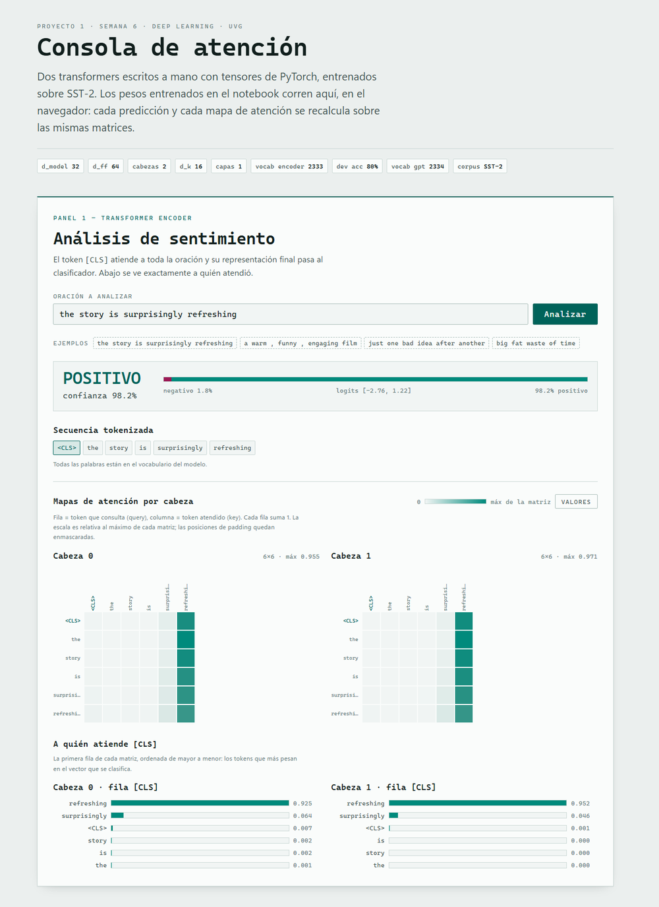

# Transformer desde cero

Dos transformers implementados con tensores puros de PyTorch —sin `nn.MultiheadAttention`, sin `nn.TransformerEncoder`, sin ninguna capa de alto nivel— entrenados sobre SST-2, y una consola web interactiva que corre esos mismos pesos entrenados en el navegador.

**Proyecto 1 · Semana 6 · Deep Learning · Universidad del Valle de Guatemala**

| | |
|---|---|
| 🎥 **Video (3 min)** | https://youtu.be/-lcFecdoXeA |
| 🧠 **Artifact interactivo** | [Consola de atención](https://claude.ai/code/artifact/8ca75ba4-ea13-4987-8fda-6ae3fe7fb749) · copia offline en [`artifact_consola_atencion.html`](artifact_consola_atencion.html) |
| 📓 **Notebook** | [`S6 - Proyecto1_Semana6.ipynb`](S6%20-%20Proyecto1_Semana6.ipynb) |

---

## Qué hay adentro

**Parte 1 — Transformer Encoder** para clasificación de sentimiento. Multi-head self-attention con máscara de padding, add & layer-norm, feed-forward posicional, y un token `[CLS]` cuya representación final alimenta al clasificador binario. El `layer_norm` está implementado a mano.

**Parte 2 — Mini-GPT decoder-only** para modelado de lenguaje sobre el mismo corpus. Reutiliza los bloques del encoder pero con máscara causal: antes del softmax se suma $-\infty$ al triángulo superior de la matriz de scores, así que las posiciones futuras quedan en cero exacto. Genera texto de forma autoregresiva con muestreo por temperatura.

**Parte 3 — Consola de atención.** Una sola página HTML autocontenida que carga los pesos exportados del notebook y **reimplementa el forward pass completo de ambos modelos en JavaScript puro**. No hace llamadas de red ni carga librerías. Verificada contra PyTorch sobre los mismos pesos: la diferencia máxima, tanto en probabilidades como en pesos de atención, queda por debajo de `1e-15`.



- **Panel 1:** predicción con confianza, logits crudos, secuencia tokenizada, heatmap de atención por cabeza —hover para el valor exacto, botón para imprimir los números dentro de las celdas— y la fila `[CLS]` ordenada de mayor a menor, que es la que alimenta al clasificador.
- **Panel 2:** generación con slider de temperatura (0.5 – 1.5) y mapa de atención causal, con el triángulo superior rayado para mostrar que efectivamente queda en cero.

---

## Resultados

```
CORRECTO   | Parte 1: Transformer Encoder (dev_acc >= 60%) | 40/40
CORRECTO   | Parte 2: Mini-GPT (loss decrece >= 15%)       | 25/25
Subtotal codigo: 65/65 pts
```

| Métrica | Valor |
|---|---|
| Dev accuracy (encoder) | **80 %** en la época seleccionada |
| Accuracy sobre datos no usados para seleccionar | **73.5 %** (media de 3 corridas) |
| Loss del Mini-GPT | 5.4463 → 3.3191 en 10 épocas |
| Paridad JavaScript ↔ PyTorch | < 10⁻¹⁵ |

> **Sobre el 80 %:** es el máximo de 10 evaluaciones sobre un dev de 100 ejemplos, así que el early stopping lo empuja hacia arriba. Medido sobre 245 ejemplos que nunca se usaron para seleccionar nada, el número es 73.5 %. Ese es el que hay que citar.

### El camino hasta ahí

La configuración inicial —300 oraciones de entrenamiento, 20 épocas, sin regularización— llegaba a 99 % en train y 59 % en datos no vistos. Sobreajuste puro. Peor: el dev de 100 ejemplos tiene una desviación de ±5 puntos, así que re-ejecutar hasta que el número suba selecciona ruido, no mejora el modelo.

Cada arreglo se midió con 3 shuffles distintos, evaluando sobre un split retenido:

| Configuración | test | train |
|---|---|---|
| Original (300 oraciones, 20 épocas) | 59.3 % | 99.0 % |
| + early stopping | 60.1 % | 99.0 % |
| + dropout 0.1 | 62.9 % | 97.7 % |
| + `weight_decay=1e-2` | 49.9 % | 48.0 % |
| **Pool completo + dropout 0.1 + 10 épocas** | **73.5 %** | 78.7 % |

Lo que se ve ahí: el early stopping sube el número que mirás pero casi no mejora el modelo (+0.8 en datos honestos), `weight_decay=1e-2` es demasiado agresivo y hunde el modelo a underfit, y **los datos son la palanca real**. Pasar de 300 a 2752 oraciones vale +11 puntos por sí solo.

El efecto secundario más visible es el vocabulario, que pasa de 328 a 2333 tokens. Con eso desaparecen casi todos los `<UNK>` y el Mini-GPT empieza a generar inglés de verdad:

```
antes:   "the story 's <UNK> <UNK> ' <UNK> <UNK>"
después: "a film that does n't come along much"
```

---

## Arquitectura

Dimensiones fijas por el enunciado, idénticas en los dos modelos:

| Hiperparámetro | Valor |
|---|---|
| `d_model` | 32 |
| `d_ff` | 64 |
| Cabezas de atención | 2 |
| `d_k` | 16 |
| Capas | 1 |
| Vocabulario | 2333 (encoder) · 2334 (GPT) |
| Ventana | 16 tokens (encoder) · 14 (GPT) |

El Mini-GPT tiene **157,568 parámetros** contando solo matrices, contra los ~63 millones del Transformer original de Vaswani et al. — unas **400 veces menos**. Y de esos 157,568, el 95 % son la tabla de embeddings y la capa de salida: el transformer propiamente dicho son 8,192 parámetros.

---

## Cómo correrlo

```bash
pip install torch matplotlib numpy
jupyter notebook "S6 - Proyecto1_Semana6.ipynb"
```

Ejecutar las celdas en orden, de arriba a abajo. El corpus SST-2 se descarga solo en el Bloque 0. El entrenamiento del encoder toma alrededor de 40 segundos en CPU y el del Mini-GPT unos 2 minutos.

La celda de exportación genera `encoder_weights.json` y `gpt_weights.json`, que son los que consume el artifact.

Para ver el artifact sin conexión, basta abrir `artifact_consola_atencion.html` en cualquier navegador.

---

## Estructura

```
├── S6 - Proyecto1_Semana6.ipynb     Notebook con las 4 partes, ejecutado
├── artifact_consola_atencion.html   Artifact autocontenido (funciona offline)
├── encoder_weights.json             Pesos del encoder exportados
├── gpt_weights.json                 Pesos del Mini-GPT exportados
├── convergencia_encoder.png         Curvas de loss y accuracy
├── convergencia_gpt.png             Curva de loss del Mini-GPT
├── artifact_preview.png             Captura del artifact
├── sst2_train.tsv                   Corpus de entrenamiento
└── sst2_dev.tsv                     Corpus de validación
```

---

## Una limitación que vale la pena mirar

El encoder clasifica `the movie has no heart and no humor` como **POSITIVO** con 95.7 % de confianza. La atención se va a *heart* (0.485) y reparte apenas 0.42 entre las dos ocurrencias de `no`.

No es un bug: es exactamente lo que predice la arquitectura. Con una sola capa, el `[CLS]` lee representaciones de tokens que todavía no se combinaron entre sí. Puede ver *no* y puede ver *heart*, pero no existe en ninguna parte del modelo una representación de «no heart» como unidad. Componer el negador con lo negado es justamente lo que aportaría una segunda capa de encoder, que recibiría vectores ya contextualizados por la primera.

Se puede reproducir en el artifact escribiendo esa oración.

---

## Integrantes

- [@jruiz002](https://github.com/jruiz002)
- [@GerardoFdez7](https://github.com/GerardoFdez7)
- [@auyjos](https://github.com/auyjos)
